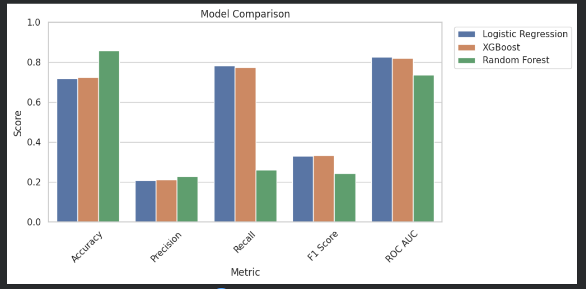
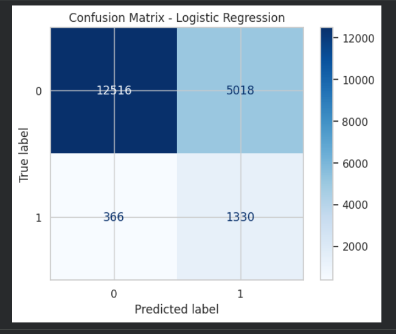

# 🧠 Diabetes Prediction (ML)

An end-to-end machine learning project for predicting diabetes risk using patient health-related features.

---

## 📌 Project Overview
This project focuses on analyzing a diabetes dataset, performing data preprocessing, exploring patterns in the data, and training machine learning models to predict whether a person is likely to have diabetes.

---


Kaggle Link:
🔗 https://lnkd.in/dxEirptw

---
## 🎯 Objectives
- 🔍 Perform Exploratory Data Analysis (EDA)
- 🧹 Clean and preprocess the dataset
- 🤖 Train and compare machine learning models
- 📊 Evaluate model performance using suitable metrics
- 💡 Extract useful insights from the data

---

## 🛠️ Tech Stack
- 🐍 Python  
- 📊 Pandas  
- 🔢 NumPy  
- 📈 Matplotlib  
- 🎨 Seaborn  
- 🤖 Scikit-learn  
- ⚡ XGBoost  
- 📓 Jupyter Notebook  

---

## ⚙️ Workflow
1. 📥 Data loading  
2. 🧹 Data cleaning and preprocessing  
3. 🔍 Exploratory Data Analysis  
4. 🧠 Feature engineering  
5. 🤖 Model training  
6. 📊 Model evaluation  
7. 💡 Final insights and conclusion  

---

## 📊 Results

### 📸 Sample Visuals

#### 📊 Model Comparison


#### 🧩 Confusion Matrix


---

## 🚀 Future Improvements
- ⚙️ Hyperparameter tuning  
- 🌐 Model deployment with Streamlit or Flask  
- 📈 Add feature importance visualization  
- 💾 Save and reuse the best trained model  

---

## 👤 Author

**Abdallah Elsheemy**  
The Post:
🔗 [https://www.linkedin.com/in/abdallah-ashraf-799063366  ](https://www.linkedin.com/posts/abdallah-ashraf-799063366_machinelearning-datascience-xgboost-activity-7432165036963512320-Zcgd?utm_source=social_share_send&utm_medium=member_desktop_web&rcm=ACoAAFrG3qUBnRDQMM149Oqm7lJCKvKiSZlJuR0)

---

## 📂 Project Structure

```text
Diabetes-Prediction-ML/
├── data/
├── notebooks/
│   └── diabetes_prediction.ipynb
├── images/
├── src/
├── README.md
├── requirements.txt
└── .gitignore
